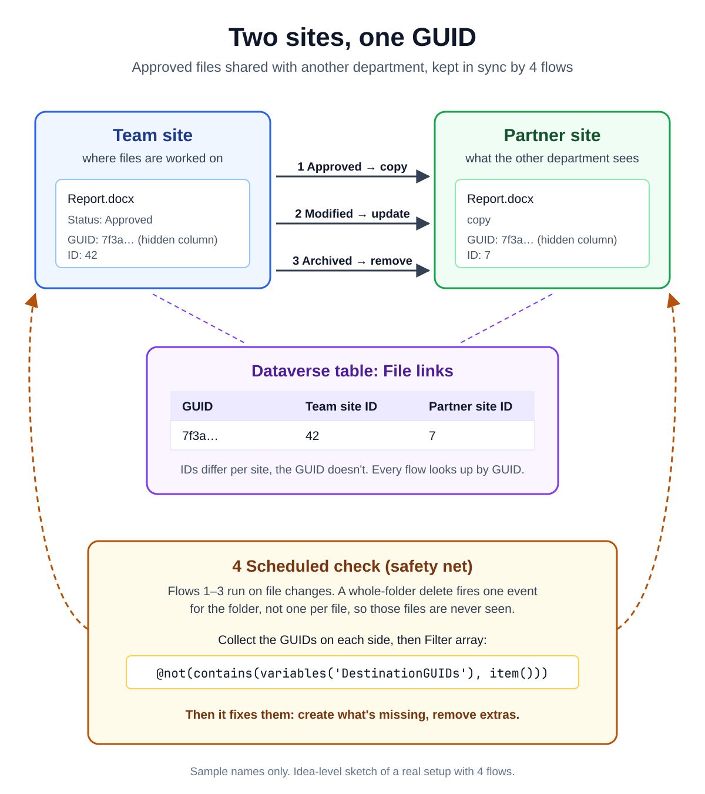

# 006 · Approved files to another site: a GUID link and a scheduled check



An idea-level sketch of a real setup: files are worked on in a team site; when a file is **Approved**, a copy goes
to a separate partner site; when the original is **archived or deleted**, the copy is removed.

## The link: a GUID, not the ID or the name
- File IDs are different on each site, and names change.
- Each file gets a GUID in a **hidden column** on both the original and the copy:
  ```
  guid()
  ```
- A **Dataverse table** keeps the pairs, so every flow can look things up by GUID:

| Column | Example |
|---|---|
| GUID | `7f3a2c1e-…` |
| Team site item ID | `42` |
| Partner site item ID | `7` |

## Four flows
1. Status → Approved: copy the file, set the GUID on both sides, add a row to the table
2. Original modified: find the copy by GUID, update it
3. Original archived or deleted: find the copy, remove it
4. **Scheduled check**: compare both sides by GUID and fix the differences (create missing copies, remove extras),
   so the partner site always matches the team site

## Why the scheduled check
Flows 1–3 run on file changes. Deleting a whole folder fires the delete trigger **once for the folder**, not once
per file ([Microsoft docs](https://learn.microsoft.com/en-us/sharepoint/dev/business-apps/power-automate/sharepoint-connector-actions-triggers)),
so those files are never seen by the file-level flows.

## Comparing the two sides by GUID (no nested loops)

1. **Select** the GUIDs from each side (Map in text mode):
   ```
   item()?['FileGUID']
   ```
   Save them as `SourceGUIDs` and `DestinationGUIDs` (or use the Select outputs directly).

2. **Filter array** — only in the source (missing on the partner site):
   ```
   From:      variables('SourceGUIDs')
   Condition: @not(contains(variables('DestinationGUIDs'), item()))
   ```

3. **Filter array** — only on the partner site (should be removed):
   ```
   From:      variables('DestinationGUIDs')
   Condition: @not(contains(variables('SourceGUIDs'), item()))
   ```

4. Need the full file records instead of just GUIDs? Filter the original array and compare one field:
   ```
   @not(contains(variables('DestinationGUIDs'), item()?['FileGUID']))
   ```

**Common mistake:** `contains(@{variables('DestinationGUIDs')}, @{item()})` — don't use `@{ }` inside an expression;
it turns the values into text.

📎 LinkedIn post: _link coming soon_
